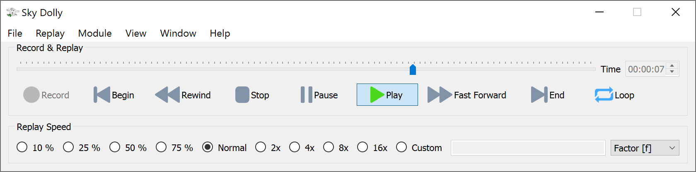

# Sky Dolly
Sky Dolly - The Black Sheep for Your Flight Recordings.

## About
Sky Dolly connects to a running Flight Simulator 2020 instance and records various simulation variables, for replay.

The connection is made via SimConnect, a standard API introduced with Flight Simulator X to connect with the flight simulator.

Aso refer to the [ABOUT.md](ABOUT.MD).

## Features
- Record / Pause / Play
- Formation flights (multiple aircraft, replay during recording, "fly with formation", time offset)
- Settable recording sample rate: fixed or variable ("auto")
- Adjustable replay speed ("slow motion", "timelapse"), replay loop
- Position, velocity and basic flight control simulation variables (ailerons, rudder, flaps, gears, ...) are recorded
- Plugin architecture with various import/export plugins (CSV, GPX, IGC, KML)
- Location module with over 100 default locations and import/export functionality
- Database (SQLite) based persistence ("logbook")

Watch the (preview) release trailer on [YouTube](https://www.youtube.com/watch?v=_n4qRtm78_I):

")

For more videos created with Sky Dolly also refer to [SHOWCASE](SHOWCASE.md). New and upcoming features are found in the [CHANGELOG](CHANGELOG.md).

## Basic Usage

- Start a flight
- Click on "Record" (key R)
- You may pause recording (key P)
- Stop recording (key R) and click on "Play" (spacebar)
- Adjust the replay speed and seek the play position, also during replay
- Recorded flights are automatically persisted in the "logbook"
- Select a flight in the logbook and press "Load" (or double-click the row) to load the persisted flight

### Formation Recording & Replay

#### Recording

- Switch to the "Formation" module (key F2)
- Click on "Record" (key R)
- Each recorded aircraft is added to the current flight
- While existing aircraft are replayed during the recording with "auto" sample rate you may still change the recording sample rate 

#### Position

- The last recorded aircraft becomes the "user aircraft" (being followed by the camera in the flight simulator)
- Select a position relative to the current "user aircraft" before recording

#### Replay

- Simply click on "Play", "Pause" and seek in the timeline, just like with a single aircraft flight
- Change the "user aircraft" (also during replay) to "jump from cockpit to cockpit"
- Take control of the "user aircraft" by selecting either "Take control" or "Fly with Formation" option

#### Managing Formations

- You may delete single aircraft from a flight ("formation")
- There must be at least one aircraft per flight, so the last aircraft cannot be deleted
- Add a time offset to the selected aircraft ("multiplayer formation flight synchronisation")
- To start a new, single-aircraft flight change back to the "Logbook" module (key F1) and click on "Record" (key R)

Why don't you try it with one of the guided ["Tell Tours"](https://github.com/till213/Tell-Tours)? :)

## Download

Go to [Releases](https://github.com/till213/SkyDolly/releases) and download the latest release.

Latest (pre-)release: **Sky Dolly 0.19.0**

Compute and compare your checksum against the [published SHA-256 checksums](SHASUM256.md), to verify the integrity of your downloaded copy.

## Build

Refer to the [BUILD](BUILD.md) documentation.

## Related Projects

- https://github.com/nguyenquyhy/Flight-Recorder - A .Net based flight recording & replay application
- https://github.com/saltysimulations/saltyreplay/ - A recording & replay with a web user interface
- https://github.com/SAHorowitz/MSFS2020-PilotPathRecorder - Records the flight and generates Google Earth (KML format) "replays"
- https://github.com/Elephant42/FS_Tool - A simple tool that allows to set the aircraft location and simulation rate
- https://github.com/pyviator/msfs-geoshot - Takes screenshots and automatically "geotags" them
- https://github.com/ijl20/msfs_logger_replay - IGC logger and replay (for FSX)
- https://joinfs.net/ - Allows to synchronise multiplayer flights across different flight simulators (MSFS, Prepar3D/FSX, XPlane). Also provides a flight recorder with formation flight recording ("overdub").
- https://github.com/paulalexandrow/a32nx-webremote - WebRemote for FlyByWire's A32NX: control cockpit functionality of the FBW A320, using FSUIPC7
- https://flightloganalyzer.com/ - FlightLog Analyer analyses the MSFS logbook and has a CSV export readable by Sky Dolly
- https://github.com/BojoteX/FSAutoSave/ - FSAutoSave automatically (or upon request) stores flight plans
- https://github.com/mracko/MSFS-Landing-Inspector - Analyses your landing performance
- [Points of Interest (Google Maps)](https://www.google.com/maps/d/viewer?mid=1KUg5jwyT_9k2A9n5IZ99UChlhfVUfO5S&ll=-3.81666561775622e-14%2C-23.028915134521867&z=1) - Points of Interest, Airports and 3D cities in Microsoft Flight Simulator.

## Other Useful Resources

- https://obsproject.com/ - Screen capture / broadcast application
- https://sqlitebrowser.org/ - Browse the Sky Dolly logbook (*.sdlog) database files, execute your own SQL queries
