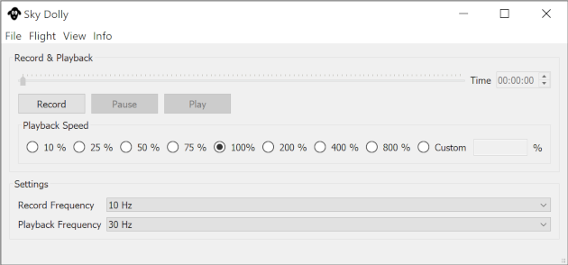

# Sky Dolly
Sky Dolly - The black sheep for your flight recordings.

## About
Sky Dolly connects to a running Flight Simulator 2020 instance and records various simulation variables, for replay.

The connection is made via SimConnect, a standard API introduced with Flight Simulator X to connect with the flight simulator. So while I cannot test this myself Sky Dolly theoretically also works with flight simulators other than Flight Simulator 2020.

## Features
* Record / Pause / Play
* Variable sample rates, for both recording and playback
* Adjustable replay speed ("slow motion", "timelapse")

## Basic Usage

* Start a flight
* Click on "Record" (key R)
* You may pause recording (key P)
* Stop recording (key R) and click on "Play" (spacebar)
* Adjust the replay speed and seek the play position, also during playback

## Download

Go to [Releases](https://github.com/till213/SkyDolly/releases) and download the latest release.

Latest (pre-)release: **Sky Dolly 0.2.0**

## Related Projects

* https://github.com/nguyenquyhy/Flight-Recorder
* https://github.com/saltysimulations/saltyreplay/

