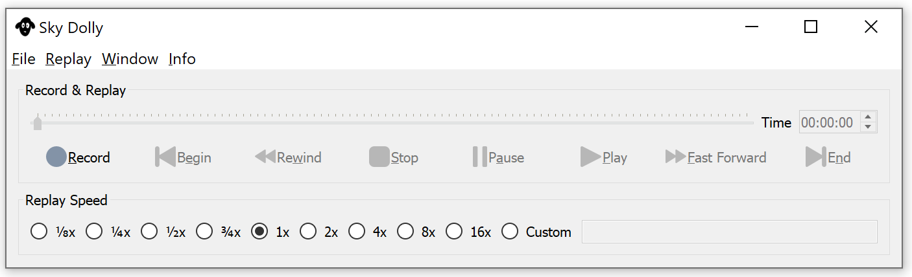

# Sky Dolly
Sky Dolly - The black sheep for your flight recordings.

## About
Sky Dolly connects to a running Flight Simulator 2020 instance and records various simulation variables, for replay.

The connection is made via SimConnect, a standard API introduced with Flight Simulator X to connect with the flight simulator.

## Features
* Record / Pause / Play
* Settable recording sample rate: fixed or variable ("auto")
* Adjustable replay speed ("slow motion", "timelapse")
* Position and basic flight control simulation variables (ailerons, rudder, flaps, gears, ...) are recorded
* Basic CSV import & export

Watch a comparison of the various sample rates on [YouTube](https://www.youtube.com/watch?v=bfgkY0eXL4w):

")

For new and upcoming features also refer to the [CHANGELOG](CHANGELOG.md).

## Basic Usage

* Start a flight
* Click on "Record" (key R)
* You may pause recording (key P)
* Stop recording (key R) and click on "Play" (spacebar)
* Adjust the replay speed and seek the play position, also during replay

Why don't you try it with one of the guided ["Tell Tours"](https://github.com/till213/Tell-Tours)? :)

## Download

Go to [Releases](https://github.com/till213/SkyDolly/releases) and download the latest release.

Latest (pre-)release: **Sky Dolly 0.5.1**

## Build

Refer to the [BUILD](BUILD.md) documentation.

## Related Projects

* https://github.com/nguyenquyhy/Flight-Recorder - A .Net based flight recording & replay application
* https://github.com/saltysimulations/saltyreplay/ - A recording & replay with a web user interface
* https://github.com/SAHorowitz/MSFS2020-PilotPathRecorder - Records the flight and generates Google Earth (KML format) "replays"

## Other Useful Resources

* https://obsproject.com/ - Screen capture / broadcast application
