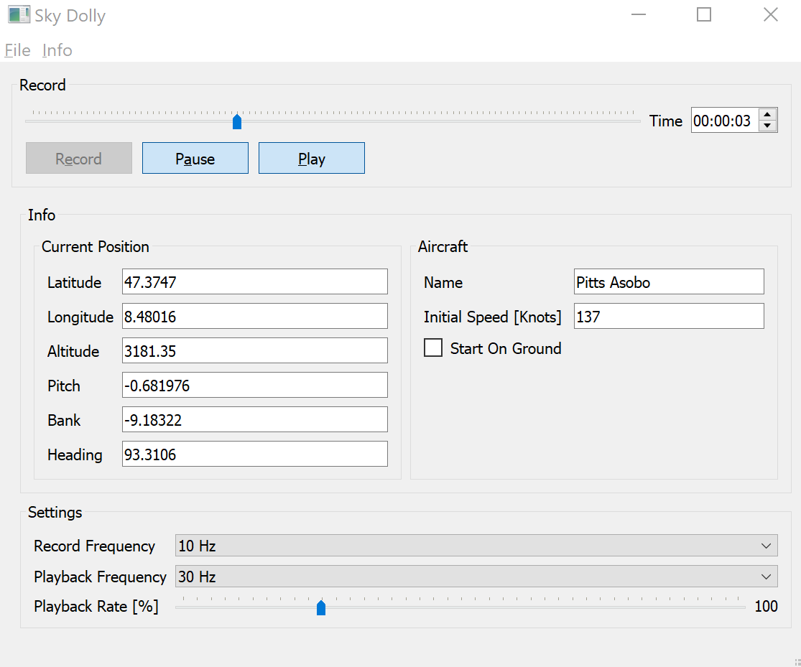

# Sky Dolly
Sky Dolly - The black sheep for flight simulators.

## About
Sky Dolly connects to a running Flight Simulator 2020 instance and records various simulation variables, for replay.

## Basic Features
* Record
* Pause / Resume
* Play
* Variable sample rates (for both recording and playback)
* Adjustable replay speed ("slow motion", "timelapse")

## Related Projects

* https://github.com/nguyenquyhy/Flight-Recorder
* https://github.com/saltysimulations/saltyreplay/

