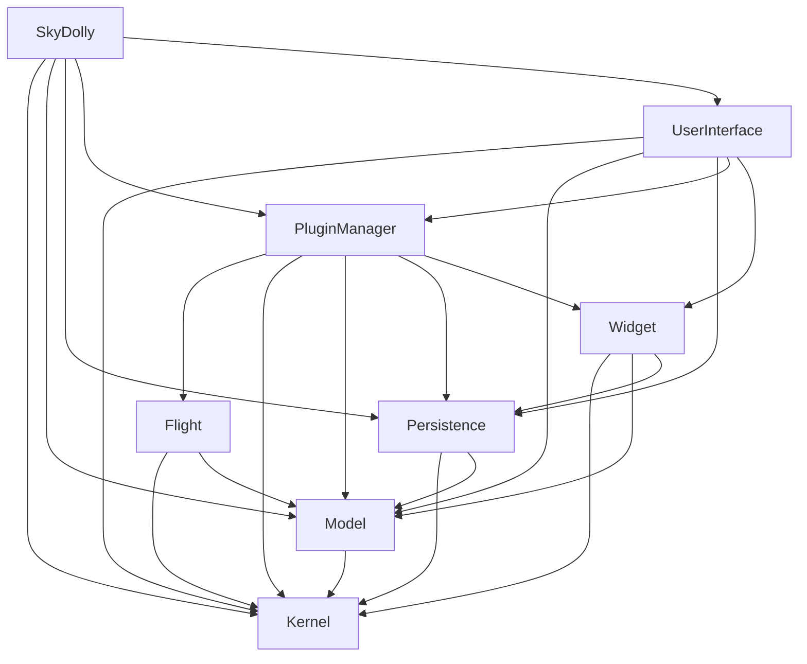
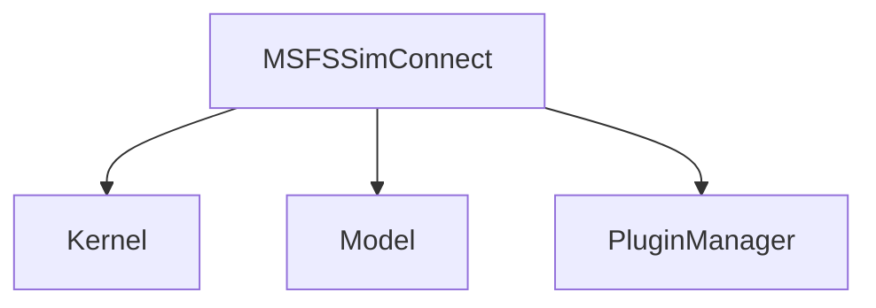
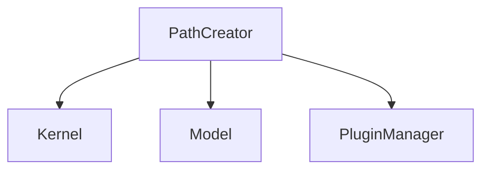

# Architecture
Sky Dolly's architecture is a monolithic, modular architecture extendable by plugins.

## Module Dependencies

## Plugin Dependencies
### Connect Plugins
#### MSFSSimConnect

#### PathCreator

### Flight Export Plugins
#### CSVExport

