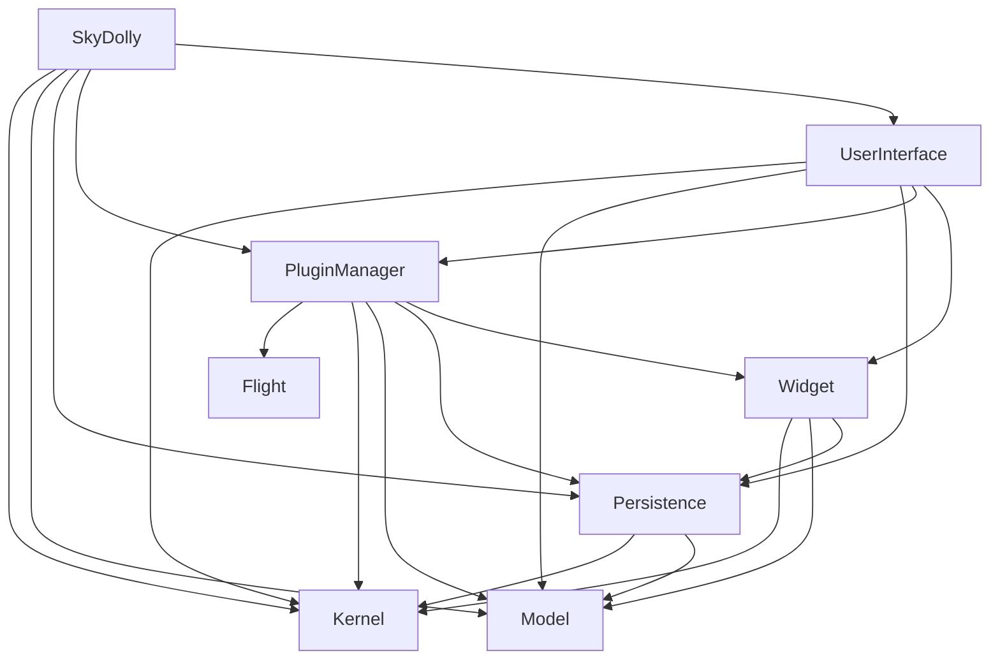

# Module Dependencies

```mermaid
  graph TD;
      SkyDolly-->Kernel;
      SkyDolly-->Model;
      SkyDolly-->Persistence;
      SkyDolly-->PluginManager;
      SkyDolly-->UserInterface;
      UserInterface-->Kernel;
      UserInterface-->Model;
      UserInterface-->Persistence;
      UserInterface-->PluginManager;
      UserInterface-->Widget;
      Widget-->Kernel;
      Widget-->Model;
      Widget-->Persistence;
      PluginManager-->Flight;
      PluginManager-->Kernel;
      PluginManager-->Model;
      PluginManager-->Persistence;
      PluginManager-->Widget;
      Persistence-->Kernel;
      Persistence-->Model;
```
