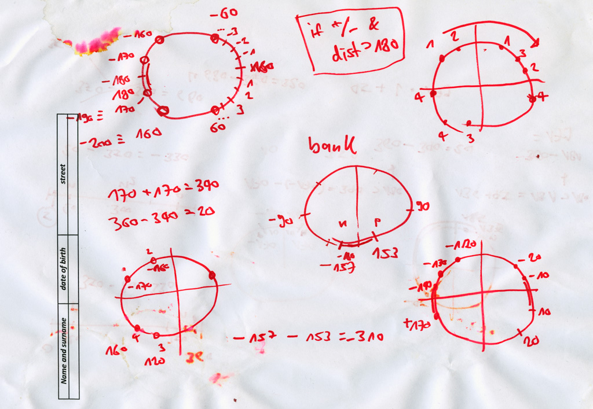
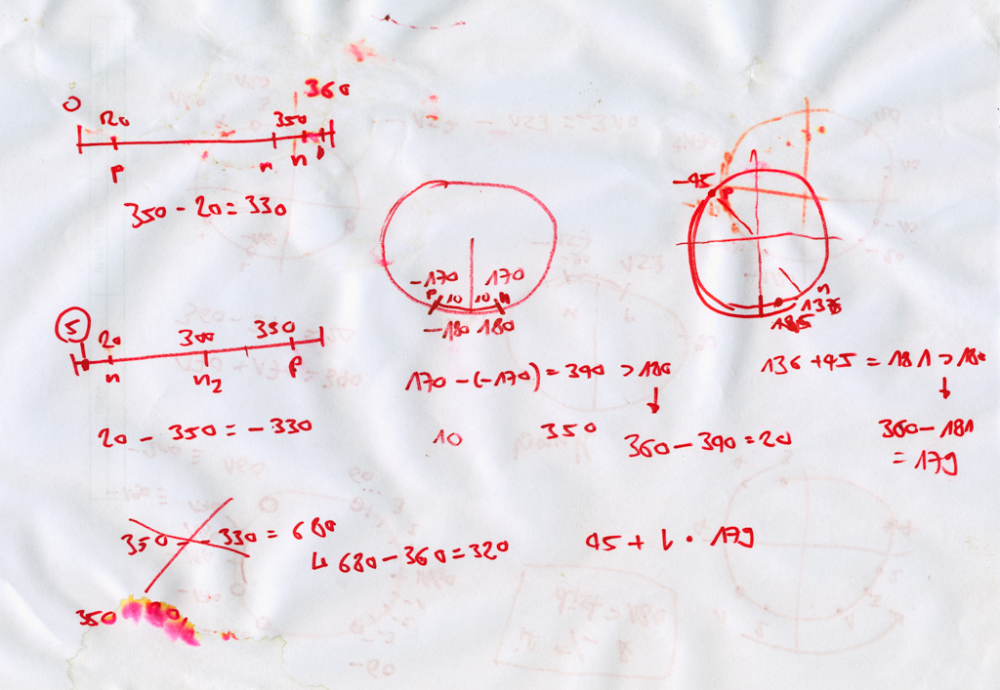
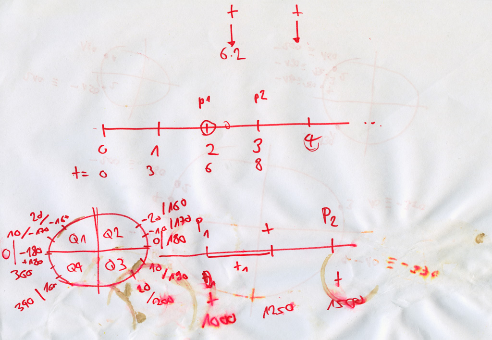
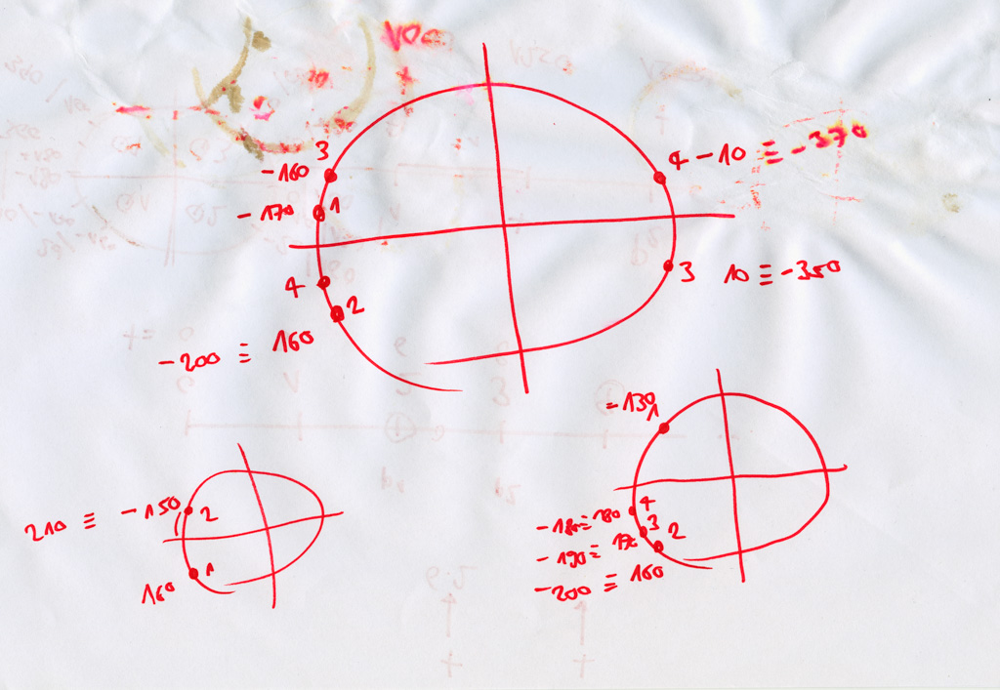
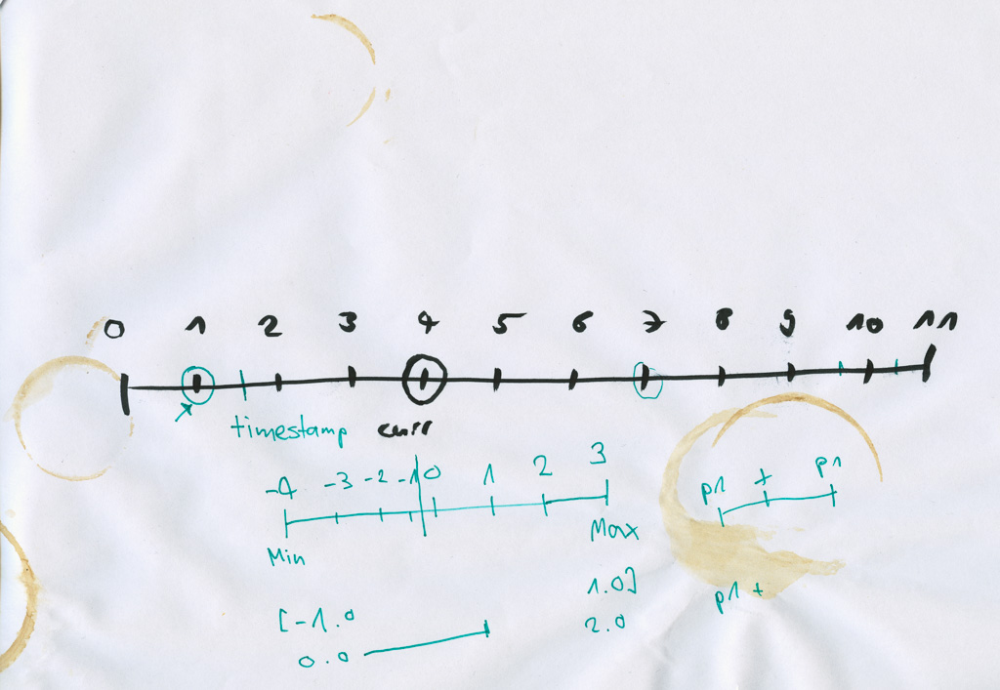
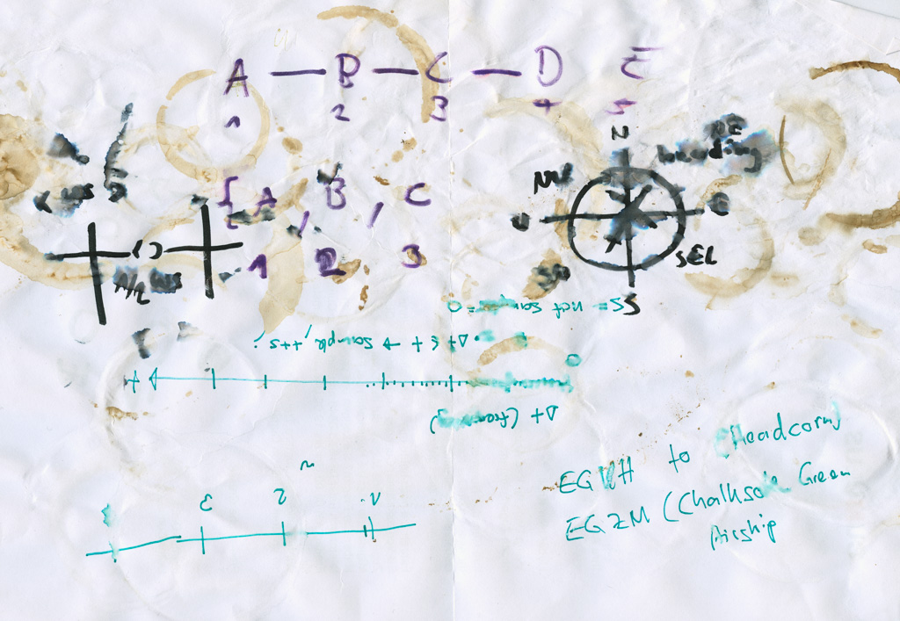
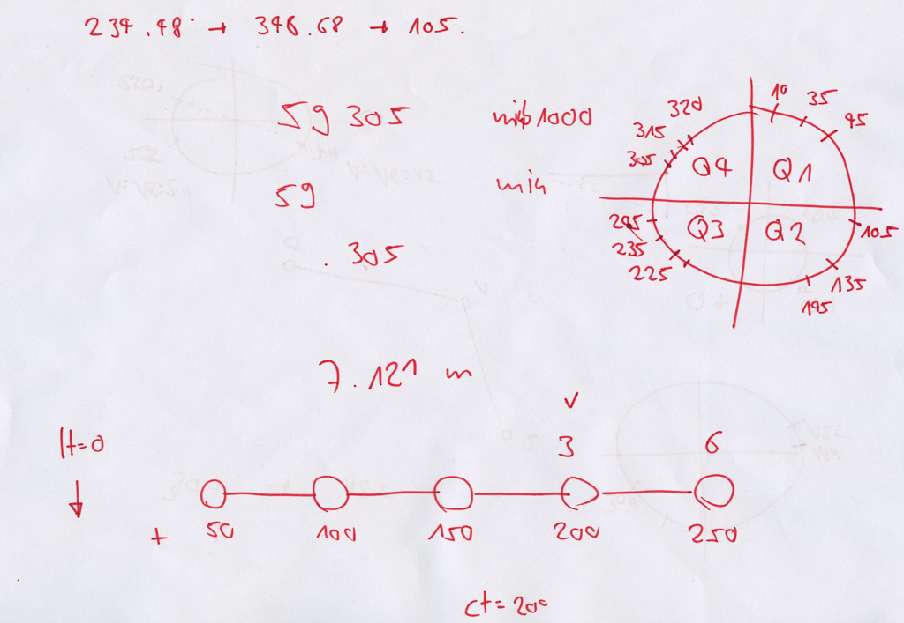
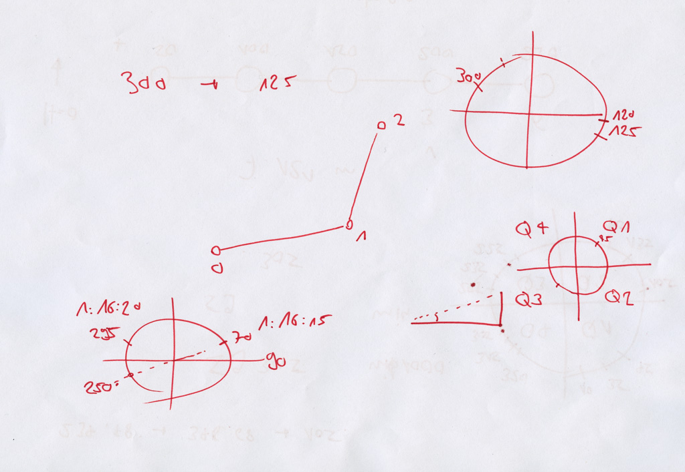

# Design

## In a Nutshell
Sky Dolly is a stand-alone application which communicates via the SimConnect API with the flight simulator. During recording the flight a selected set of so-called _simulation variables_ such as latitude, longitude and altitude is received and during replay sent back to the flight simulator.

## Plugin Architecture
The functionality of Sky Dolly can be extended at run-time with plugins. The following areas are currently _plugable_:

- Connection with flight simulator
- Import
- Export

The plugins have access to the common functionality such as data interpolation, persistence and flight analytics, which is provided in modules (shared libraries).

## Persistence
All recorded flights are automatically persisted in a database, called the _logbook_. SQLite is used as database technology, a simple but efficient file-based database.

Data is read and written via data access objects (DAO), which on their turn are used by _services_: they take care of transaction management and provide the data to the application.

## Sampling
Sky Dolly does not rely on a _fixed_ interval sampling: instead it uses a dynamic event-based sampling, or in other words: "as data _changes_ become available". However the _recording_ sample rate _can: be set to a fixed sample interval like 60, 30, 20 or even lower values like 1 Hz. But this is rather to reduce the number of sample points.

The _replay_ sample rate on the other hand is always event-based ("per simulated frame"), so it is essentially the flight simulator that controls the sample rate.

In any case the data is interpolated during replay. Depending on the use case various interpolation methods are applied, ranging from simple _nearest neighbour_, _linear_ to a bit more sophisticated _cubic spline_ interpolation. For instance a lever in the cockpit is expected to be moved in a "linear fashion", while the flight position may be more erratic, so cubic spline interpolation is applied for aircraft position and attitude.

Resampling may also be applied in various export plugins, in order to reduce the number of exported sample points.

## Design Papers
Here are some historical _design papers_ that kept piling up next to my computer. They illustrate the fact that Sky Dolly was one of the very few replay tools that got "modulo interpolation" correct from the very beginning, realising that e.g. heading values are to be interpolated "modulo 360".

Those "design papers" shall also illustrate my historic coffee consumption ;)

